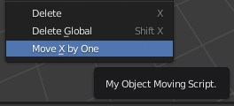

# Blender API Scripting

# Python Tooltips

Zum Herausfinden von blender-eigenen IDs für alle Buttons und Menüpunkten kann man in den `Preferences` die `Python Tooltips` anschalten. Danach kann man über einen Button hovern, um die ID zu sehen und im Skript zu nutzen (zum Beispiel zum Hinzufügen von eigenen Buttons).

Siehe auch: https://medium.com/@satishgoda/setting-up-blender-2-8-for-developing-with-python-3-7-6330d87c17b4

# Shortcuts

`CTRL+ALT+SHIFT+C` -> Kopiert den gesamten Pfad zu einem Objekt etc.

# Grundgerüst für ein Add-On

Ein erstes Add-On, was alle Objekte auf der X-Achse um eine Einheit nach rechts bewegt, sieht wie folgt aus:

```python
bl_info = {
  "name": "Move X Axis",
  "blender": (2, 80, 0),
  "category": "Object",
}

import bpy

class ObjectMoveX(bpy.types.Operator):
  """My Object Moving Script"""
  bl_idname = "object.move_x"
  bl_label = "Move X by One"
  bl_options = {"REGISTER", "UNDO"}

  def execute(self, context):

    # The original script
    scene = context.scene
    for obj in scene.objects:
      obj.location.x += 1.0

    return {"FINISHED"}


def menu_func(self, context):
    self.layout.operator(ObjectMoveX.bl_idname)

def register():
    bpy.utils.register_class(ObjectMoveX)
    bpy.types.VIEW3D_MT_object.append(menu_func)

def unregister():
    bpy.utils.unregister_class(ObjectMoveX)

if __name__ == "__main__":
  register()

```

Der Code kann in einer einzigen Datei mit der Endung .py gespeichert und dann installiert werden.

# Installieren

Preferences -> Add-ons -> Install...

Dann die .py Datei auswählen und die Checkbox aktivieren.
Blender ruft dann automatisch die `register`-Funktion auf, was das Add-On ins "Object"-Menü einfügt:

<p align="center">

</p>

# Wichtige Befehle

## Aktives (angeklicktes) Object auswählen

```python
import bpy
from bpy import context

active_object = context.active_object

print(active_object)
```

## Aktives Material auswählen

```python
# get the active material_slot that was assigned to the object
active_material_slot = active_object.active_material
```
